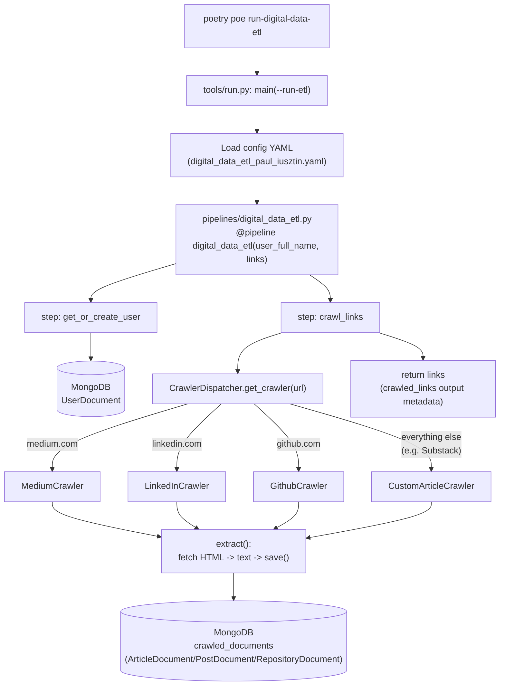

# `digital_data_etl` Pipeline

Triggered by `poetry poe run-digital-data-etl` (runs once per author config: `digital_data_etl_maxime_labonne.yaml` and `digital_data_etl_paul_iusztin.yaml`).

## Pipeline task

`run-digital-data-etl` is a composite [poe](https://poethepoet.natn.io/) task — it doesn't run anything itself, it just runs two sub-tasks in sequence, one per author config ([pyproject.toml:71-77](../pyproject.toml#L71-L77)):

```toml
[tool.poe.tasks]
run-digital-data-etl-alex = "echo 'It is not supported anymore.'"
run-digital-data-etl-maxime = "poetry run python -m tools.run --run-etl --no-cache --etl-config-filename digital_data_etl_maxime_labonne.yaml"
run-digital-data-etl-paul = "poetry run python -m tools.run --run-etl --no-cache --etl-config-filename digital_data_etl_paul_iusztin.yaml"
run-digital-data-etl = [
    "run-digital-data-etl-maxime",
    "run-digital-data-etl-paul",
]
```

Each sub-task invokes `python -m tools.run` with:

- `--run-etl` — tells [main()](../tools/run.py#L113) to execute the `if run_etl:` branch ([tools/run.py:154-159](../tools/run.py#L154-L159))
- `--no-cache` — disables ZenML step caching for the run
- `--etl-config-filename` — picks which YAML under `configs/` supplies the `user_full_name` and `links` pipeline parameters

## Diagram



## Key read

The pipeline itself only passes `links` (strings) between its two steps — the actual scraped content never flows through ZenML's step outputs. Each crawler writes straight to MongoDB as a side effect inside `crawl_links`, which is why the next pipeline in the chain (`run-feature-engineering-pipeline`) starts by *reading* from the `crawled_documents` collection rather than receiving data directly from `digital_data_etl`.

## Function call reference

Each diagram node, linked to its definition:

| Diagram node | Function | Location |
| --- | --- | --- |
| `main(--run-etl)` | `main()` | [tools/run.py:113](../tools/run.py#L113) |
| ETL branch that builds and runs the pipeline | `if run_etl:` block | [tools/run.py:154-159](../tools/run.py#L154-L159) |
| `digital_data_etl(user_full_name, links)` | `digital_data_etl()` | [pipelines/digital_data_etl.py:7](../pipelines/digital_data_etl.py#L7) |
| `step: get_or_create_user` | `get_or_create_user()` | [steps/etl/get_or_create_user.py:10](../steps/etl/get_or_create_user.py#L10) |
| → creates/looks up the user doc | `UserDocument.get_or_create()` | [steps/etl/get_or_create_user.py:15](../steps/etl/get_or_create_user.py#L15) |
| `step: crawl_links` | `crawl_links()` | [steps/etl/crawl_links.py:13](../steps/etl/crawl_links.py#L13) |
| → per-link crawl + error handling | `_crawl_link()` | [steps/etl/crawl_links.py:34](../steps/etl/crawl_links.py#L34) |
| `CrawlerDispatcher.get_crawler(url)` | `get_crawler()` | [llm_engineering/application/crawlers/dispatcher.py:44](../llm_engineering/application/crawlers/dispatcher.py#L44) |
| → domain registration (Medium/LinkedIn/GitHub) | `register_medium()` / `register_linkedin()` / `register_github()` | [dispatcher.py:23-36](../llm_engineering/application/crawlers/dispatcher.py#L23-L36) |
| `extract(): fetch HTML -> text -> save()` (fallback crawler, e.g. Substack) | `CustomArticleCrawler.extract()` | [llm_engineering/application/crawlers/custom_article.py:18](../llm_engineering/application/crawlers/custom_article.py#L18) |
| `save()` → MongoDB write | `NoSQLBaseDocument.save()` | [llm_engineering/domain/base/nosql.py:67](../llm_engineering/domain/base/nosql.py#L67) |

## Relevant files

- [pyproject.toml](../pyproject.toml) — `run-digital-data-etl` poe task definition
- [tools/run.py](../tools/run.py) — CLI entry point
- [pipelines/digital_data_etl.py](../pipelines/digital_data_etl.py) — ZenML pipeline definition
- [steps/etl/get_or_create_user.py](../steps/etl/get_or_create_user.py)
- [steps/etl/crawl_links.py](../steps/etl/crawl_links.py)
- [llm_engineering/application/crawlers/dispatcher.py](../llm_engineering/application/crawlers/dispatcher.py)
- [llm_engineering/application/crawlers/custom_article.py](../llm_engineering/application/crawlers/custom_article.py)
- [llm_engineering/domain/base/nosql.py](../llm_engineering/domain/base/nosql.py) — `save()`/`get_or_create()` persistence layer
