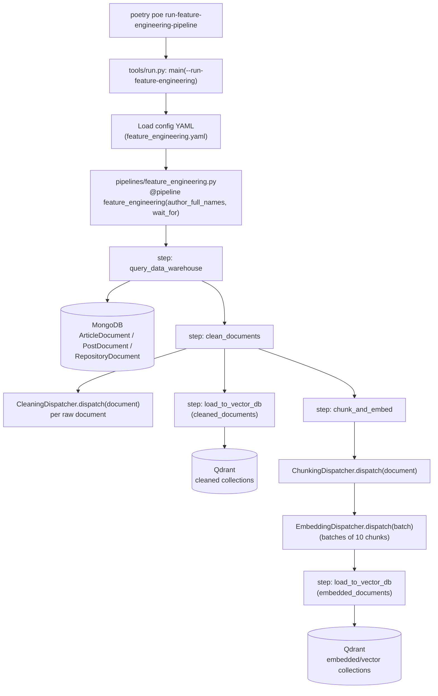

# `feature_engineering` Pipeline

Triggered by `poetry poe run-feature-engineering-pipeline`. This is the pipeline that runs *after* `digital_data_etl` — it reads the raw crawled documents back out of MongoDB and turns them into cleaned + chunked + embedded documents in Qdrant, ready for RAG and training.

## Pipeline task

Unlike `run-digital-data-etl`, this is a single, non-composite poe task ([pyproject.toml:78](../pyproject.toml#L78)):

```toml
run-feature-engineering-pipeline = "poetry run python -m tools.run --no-cache --run-feature-engineering"
```

- `--run-feature-engineering` — tells [main()](../tools/run.py#L113) to execute the `if run_feature_engineering:` branch ([tools/run.py:168-172](../tools/run.py#L168-L172))
- `--no-cache` — disables ZenML step caching for the run
- Parameters come from [configs/feature_engineering.yaml](../configs/feature_engineering.yaml) (`author_full_names`), not from a `--*-config-filename` flag — the path is hardcoded in `main()`

## Diagram



## Key read

`load_to_vector_db` is called **twice** in the same pipeline run ([feature_engineering.py:11](../pipelines/feature_engineering.py#L11) and [:14](../pipelines/feature_engineering.py#L14)) — once for the plain cleaned documents (dedup/lookup collections) and once for the chunked+embedded documents (the actual RAG vector collections). It's the same step function reused with two different inputs, not two different steps. Also note `clean_documents` fans out into *both* branches (`load_to_vector_db` directly, and `chunk_and_embed` → `load_to_vector_db`) — cleaning only happens once, but its output feeds two independent downstream paths.

## Function call reference

| Diagram node | Function | Location |
| --- | --- | --- |
| `main(--run-feature-engineering)` | `main()` | [tools/run.py:113](../tools/run.py#L113) |
| branch that builds and runs the pipeline | `if run_feature_engineering:` block | [tools/run.py:168-172](../tools/run.py#L168-L172) |
| `feature_engineering(author_full_names, wait_for)` | `feature_engineering()` | [pipelines/feature_engineering.py:7](../pipelines/feature_engineering.py#L7) |
| `step: query_data_warehouse` | `query_data_warehouse()` | [steps/feature_engineering/query_data_warehouse.py:13](../steps/feature_engineering/query_data_warehouse.py#L13) |
| → parallel per-author Mongo fetch | `fetch_all_data()` | [query_data_warehouse.py:37](../steps/feature_engineering/query_data_warehouse.py#L37) |
| `step: clean_documents` | `clean_documents()` | [steps/feature_engineering/clean.py:9](../steps/feature_engineering/clean.py#L9) |
| → per-document cleaning by type | `CleaningDispatcher.dispatch()` | [llm_engineering/application/preprocessing/dispatchers.py:44](../llm_engineering/application/preprocessing/dispatchers.py#L44) |
| `step: load_to_vector_db` (both calls) | `load_to_vector_db()` | [steps/feature_engineering/load_to_vector_db.py:10](../steps/feature_engineering/load_to_vector_db.py#L10) |
| → Qdrant bulk write | `VectorBaseDocument.bulk_insert()` | [llm_engineering/domain/base/vector.py:80](../llm_engineering/domain/base/vector.py#L80) |
| `step: chunk_and_embed` | `chunk_and_embed()` | [steps/feature_engineering/rag.py:11](../steps/feature_engineering/rag.py#L11) |
| → splits cleaned text into chunks | `ChunkingDispatcher.dispatch()` | [dispatchers.py:75](../llm_engineering/application/preprocessing/dispatchers.py#L75) |
| → embeds a batch of chunks | `EmbeddingDispatcher.dispatch()` | [dispatchers.py:108](../llm_engineering/application/preprocessing/dispatchers.py#L108) |

## Relevant files

- [pyproject.toml](../pyproject.toml) — `run-feature-engineering-pipeline` poe task definition
- [tools/run.py](../tools/run.py) — CLI entry point
- [configs/feature_engineering.yaml](../configs/feature_engineering.yaml) — pipeline parameters
- [pipelines/feature_engineering.py](../pipelines/feature_engineering.py) — ZenML pipeline definition
- [steps/feature_engineering/query_data_warehouse.py](../steps/feature_engineering/query_data_warehouse.py)
- [steps/feature_engineering/clean.py](../steps/feature_engineering/clean.py)
- [steps/feature_engineering/rag.py](../steps/feature_engineering/rag.py)
- [steps/feature_engineering/load_to_vector_db.py](../steps/feature_engineering/load_to_vector_db.py)
- [llm_engineering/application/preprocessing/dispatchers.py](../llm_engineering/application/preprocessing/dispatchers.py) — cleaning/chunking/embedding dispatch logic
- [llm_engineering/domain/base/vector.py](../llm_engineering/domain/base/vector.py) — Qdrant persistence layer (`bulk_insert`, `group_by_class`)
